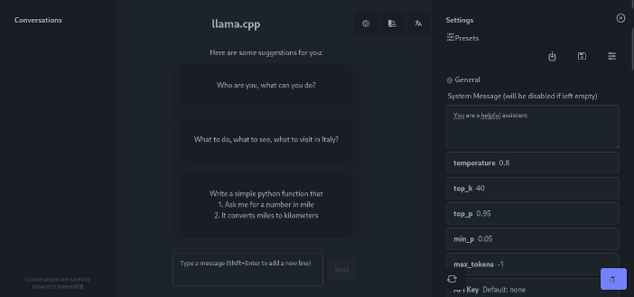
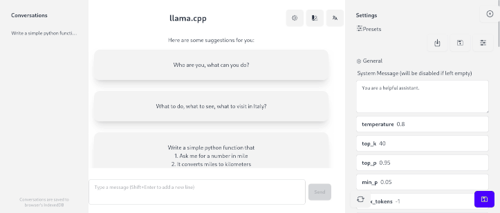
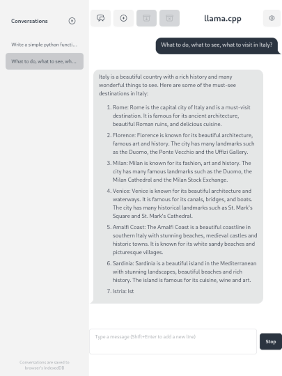
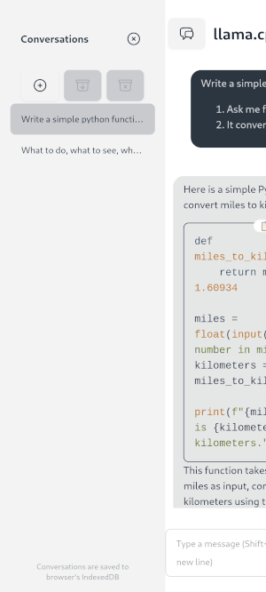
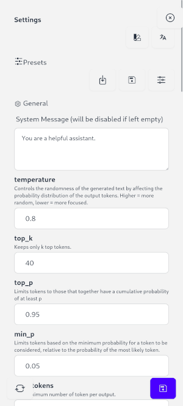
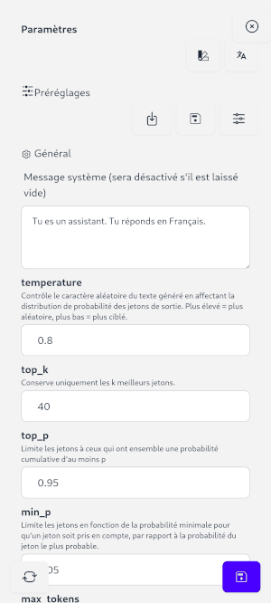

# LLaMA.cpp Web UI

The project includes a web-based user interface that enables interaction with the model through the `/chat/completions`
endpoint.  
It's based on [llama.cpp/examples/server/webui](https://github.com/ggml-org/llama.cpp/tree/master/examples/server/webui)
trying to be more accessible for non-it people, more intuitive and easier to maintain.

**Features:**

- Localisations (Chinese, Dutch, English, French, Italian, Spanish, Russian)
- Conversations
  - save / load / delete all conversations, your work
- Settings tab
  - with Presets (multilingual)
    - save / load / delete presets
- Ideas of questions (loaded with presets)
- Mobile, medium devices and desktop UI/UX
- HTML code preview
- SVG image preview
- Change API URL from URL parameter (#h=https://127.0.0.1:1234)
- Pre-input, pre-send message from URL (#m=message, #q=sendMessage)
- Markdown / Math render (from legacy project)
- Languages code highlight (from legacy project)
- [Experimental] Python interpreter (from legacy project)


## Prompt master

To quickly make a change in your settings you can go to the Settings tab.  
You can easily change the System message, the main option are just down there like temperature, top_k, top_p, etc...

To save your preset, click on the save button on the bottom-right corner.  
If you want to use many presets, you can enter a name in the "preset" input on the top of the settings tab.  
Before closing your browser, you can save all your changes and load them next time.

### Json presets format

If you want to manually set some presets, use the json configuration file.
If you leave language empty, it will show in all languages.
When loading, the first preset of the list in your language will be used.
When you change language, presets will be reloaded using the new language if the preset input is empty.

Here a full example of json presets :

```json
{
  "presets": [
    {
      "name": "Configuration example",
      "lang": "en",
      "config": {
        "apiKey": "",
        "custom": "",
        "dry_allowed_length": 2,
        "dry_base": 1.75,
        "dry_multiplier": 0,
        "dry_penalty_last_n": -1,
        "dynatemp_exponent": 1,
        "dynatemp_range": 0,
        "excludeThoughtOnReq": true,
        "frequency_penalty": 0,
        "max_tokens": -1,
        "min_p": 0.05,
        "presence_penalty": 0,
        "pyIntepreterEnabled": false,
        "repeat_last_n": 64,
        "repeat_penalty": 1,
        "samplers": "edkypmxt",
        "showThoughtInProgress": false,
        "showTokensPerSecond": false,
        "systemMessage": "You are a helpful assistant.",
        "temperature": 0.8,
        "top_k": 40,
        "top_p": 0.95,
        "typical_p": 1,
        "xtc_probability": 0,
        "xtc_threshold": 0.1,
        "questionIdeas": [
          "Who are you, what can you do?",
          "What to do, what to see, what to visit in Italy?",
          "Write a simple python function that\n1. Ask me for a number in mile\n2. It converts miles to kilometers"
        ]
      }
    },
    {
      "name": "Python Coder",
      "lang": "",
      "config": {
        "systemMessage": "You are a coder assistant. You will answer returning python code of what the user asked for.",
        "temperature": 0.6,
        "top_k": 20,
        "pyIntepreterEnabled": true,
        "questionIdeas": [
          "Write a simple python function that\n1. Ask me for a number in mile\n2. It converts miles to kilometers"
        ]
      }
    }
  ]
}
```

In this example, "Python Coder" will be shown on other languages than English.
It will use the default configuration (same as example preset just above).
It will suggest `questionIdeas` when no conversation is loaded.
All settings parameters you can change are listed in the first preset.
If a parameter has not the right type, it won't be loaded and will be show a message in the console.

## Screenshots

### Desktop / Theme




### Medium devices



### Mobile / UI / Translation / Python example

#### UI

  


#### Python interpreter


Python interpreter for now can't use input, so we ask a new code:  
  


#### French translation example



## Development

The web UI is developed using:

- `react` framework for frontend development
- `tailwindcss` and `daisyui` for styling
- `vite` for build tooling
- `sonar cube` for code analysis, maintainability, security

To build or to run the dev server (with hot reload):

```sh
# make sure you have nodejs installed
cd examples/server/webui
npm i

# to run the dev server
npm run dev

# to build the public/index.html.gz
npm run build
```

Prompt and other configuration parameters are easily customisable with the json file `public/prompts.config.json` or
through loading it in the UI.
If you want to always load a file, you can rename `public/prompts.config.example.json` to `public/prompts.config.json`
and it will always be loaded at application startup.

Examples from https://github.com/f/awesome-chatgpt-prompts have been already written in it.

NOTE: if you are using the vite dev server, you can change the API base URL to llama.cpp. To do that, run this code
snippet in browser's console:

```js
localStorage.setItem('base', 'http://localhost:8080');
```

llama.cpp is under active development, and they
are [looking for feedback and contributors](https://github.com/ggml-org/llama.cpp/issues/4216).
